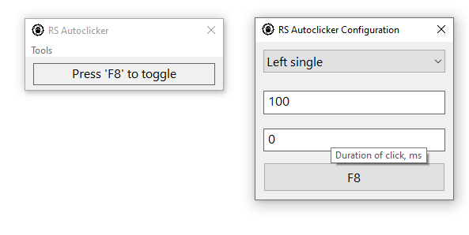

# RS Autoclicker
This program is a simple autoclicker for Windows written in Rust.  
After the first launch open Tools->Options... and set key to start and stop clicker.  
All settings are stored in %appdata%\trickybestia\rsautoclicker\\.  
## Screenshot
